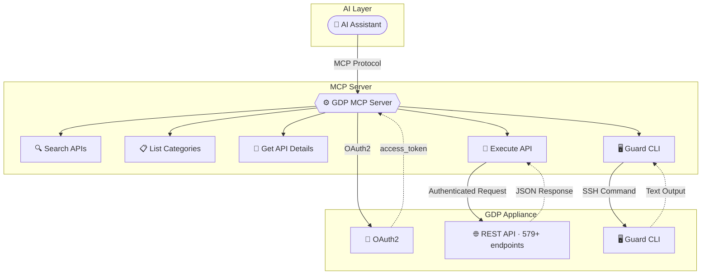
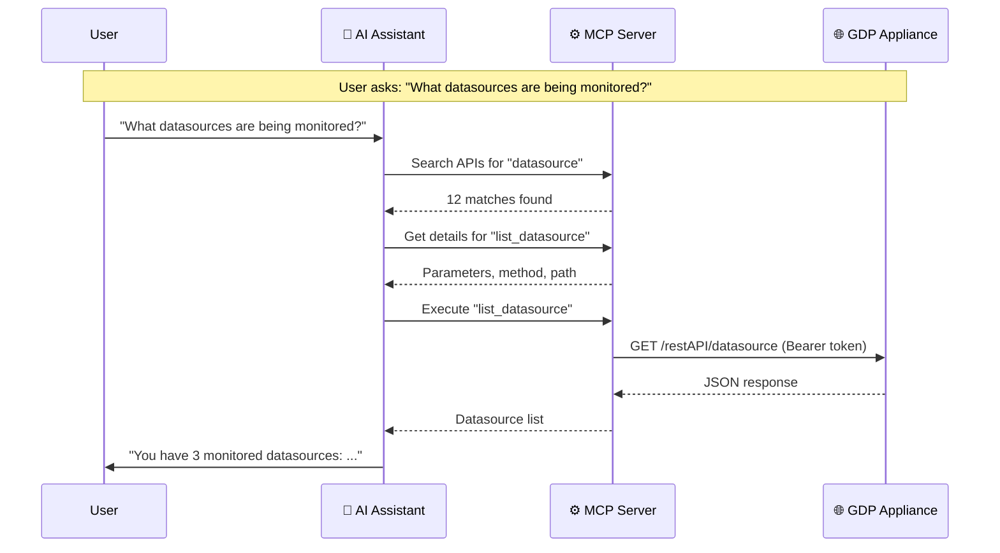
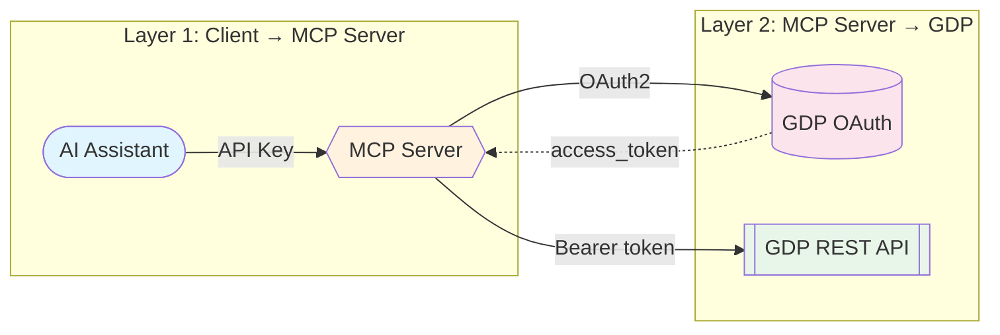

# GDP MCP Server

Let AI agents monitor database activity, enforce security policies, run compliance reports, and manage your entire Guardium deployment through natural language.

## What You Can Do

- **Run compliance reports on demand** — generate SOX, GDPR, or PCI-DSS compliance assessments across all monitored databases in seconds
- **Investigate database activity** — ask "who accessed the payroll database last week?" and get instant answers from Guardium's monitoring data
- **Manage security policies at scale** — review, update, and enforce data protection policies across multiple Guardium appliances from one conversation
- **Monitor S-TAP and system health** — check inspection engine status, disk usage, memory, and connectivity across your entire Guardium deployment

## Compatible With

IBM Bob · Claude Desktop · VS Code Copilot · watsonx Orchestrate · Any MCP-compatible AI assistant

---

## Architecture



## How the AI Navigates 579 Endpoints



## Security



---

## Setup

### Prerequisites

- Docker (recommended) **or** Python 3.11+
- Network access to your Guardium appliance on port 8443
- A registered OAuth client on the Guardium appliance (see step 1 below)

---

### Step 1 — Register an OAuth Client on the Guardium CLI

You need to do this **once per appliance**. SSH into the Guardium CLI and run:

```
grdapi register_oauth_client client_id=<YOUR_CLIENT_ID> grant_types="password"
```

Example:

```
guardium.example.com> grdapi register_oauth_client client_id=mcp-client grant_types="password"
{"client_id":"mcp-client","client_secret":"xxxxxxxx-xxxx-xxxx-xxxx-xxxxxxxxxxxx","grant_types":"password"}
ok
```

Save the `client_secret` — it is only shown once.

> If you don't have SSH/CLI access, ask your Guardium administrator to run this command and share the `client_id` and `client_secret` with you.

---

### Step 2 — Configure Environment Variables

All secrets are passed as environment variables — never hardcoded in config files.

| Variable | Required | Description | Example |
|---|---|---|---|
| `GDP_HOST` | ✅ | Guardium appliance hostname or IP | `guardium.example.com` |
| `GDP_PORT` | ✅ | Guardium HTTPS port (usually 8443) | `8443` |
| `GDP_CLIENT_ID` | ✅ | OAuth client ID from Step 1 | `mcp-client` |
| `GDP_CLIENT_SECRET` | ✅ | OAuth client secret from Step 1 | `xxxxxxxx-xxxx-...` |
| `GDP_USERNAME` | ✅ | Guardium admin username | `admin` |
| `GDP_PASSWORD` | ✅ | Guardium admin password | `••••••••` |
| `GDP_VERIFY_SSL` | ✅ | Set `false` if using a self-signed cert | `false` |
| `GDP_DISCOVERY_TIMEOUT` | ⚙️ | Seconds to wait for live API discovery before falling back to the bundled static catalog. Set `0` to skip live discovery entirely (recommended for slow appliances) | `0` |
| `GDP_CLI_HOST` | optional | Hostname for Guard CLI SSH (defaults to `GDP_HOST`) | `guardium.example.com` |
| `GDP_CLI_PORT` | optional | SSH port for Guard CLI (default: `2222`) | `2222` |
| `GDP_CLI_USER` | optional | SSH username for Guard CLI (default: `cli`) | `cli` |
| `GDP_CLI_PASS` | optional | SSH password for Guard CLI — enables the `gdp_guard_cli` tool | `••••••••` |

> **Note on SSL:** If your Guardium appliance uses a self-signed or private CA certificate, set `GDP_VERIFY_SSL=false` (Python's `httpx` does not use the OS trust store). For production, supply the CA cert path and set `GDP_VERIFY_SSL=true`.

---

### Step 3a — Run with Docker (Recommended)

Build the image once:

```bash
docker build -t gdp-mcp-server:latest .
```

Test it starts correctly:

```bash
docker run -i --rm \
  -e GDP_HOST=guardium.example.com \
  -e GDP_PORT=8443 \
  -e GDP_CLIENT_ID=mcp-client \
  -e GDP_CLIENT_SECRET=xxxxxxxx-xxxx-xxxx-xxxx-xxxxxxxxxxxx \
  -e GDP_USERNAME=admin \
  -e GDP_PASSWORD=yourpassword \
  -e GDP_VERIFY_SSL=false \
  -e GDP_DISCOVERY_TIMEOUT=0 \
  gdp-mcp-server:latest
```

You should see:
```
INFO  gdp_mcp — GDP MCP Server v2.0.0 starting — target: guardium.example.com:8443 (transport: stdio)
INFO  gdp_mcp — stdio mode — no API key auth (direct process communication)
```

---

### Step 3b — Run with Python (Local)

```bash
pip install -r requirements.txt
```

Create a `.env` file in this directory:

```env
GDP_HOST=guardium.example.com
GDP_PORT=8443
GDP_CLIENT_ID=mcp-client
GDP_CLIENT_SECRET=xxxxxxxx-xxxx-xxxx-xxxx-xxxxxxxxxxxx
GDP_USERNAME=admin
GDP_PASSWORD=yourpassword
GDP_VERIFY_SSL=false
GDP_DISCOVERY_TIMEOUT=0

# Optional — Guard CLI over SSH
# GDP_CLI_PASS=yourpassword
# GDP_CLI_HOST=guardium.example.com
# GDP_CLI_PORT=2222
# GDP_CLI_USER=cli
```

Run:

```bash
python -m src
```

---

### Step 4 — Wire up to IBM Bob

**Docker (recommended)** — set the three secret env vars at User level first:

```powershell
# Windows — run once, then restart Bob
[System.Environment]::SetEnvironmentVariable("GDP_CLIENT_SECRET", "xxxxxxxx-xxxx-xxxx-xxxx-xxxxxxxxxxxx", "User")
[System.Environment]::SetEnvironmentVariable("GDP_USERNAME", "admin", "User")
[System.Environment]::SetEnvironmentVariable("GDP_PASSWORD", "yourpassword", "User")
```

Then add to `.bob/mcp.json`:

```json
{
  "mcpServers": {
    "gdp-mcp": {
      "command": "docker",
      "args": [
        "run", "-i", "--rm",
        "-e", "GDP_HOST=guardium.example.com",
        "-e", "GDP_PORT=8443",
        "-e", "GDP_CLIENT_ID=mcp-client",
        "-e", "GDP_CLIENT_SECRET=${env:GDP_CLIENT_SECRET}",
        "-e", "GDP_USERNAME=${env:GDP_USERNAME}",
        "-e", "GDP_PASSWORD=${env:GDP_PASSWORD}",
        "-e", "GDP_VERIFY_SSL=false",
        "-e", "GDP_DISCOVERY_TIMEOUT=0",
        "gdp-mcp-server:latest"
      ],
      "disabled": false,
      "timeout": 60000
    }
  }
}
```

**Python (local)** — add to `.bob/mcp.json`:

```json
{
  "mcpServers": {
    "gdp-mcp": {
      "command": "python",
      "args": ["-m", "src"],
      "cwd": "/path/to/gdp-mcp-server",
      "disabled": false,
      "timeout": 60000
    }
  }
}
```

---

### Troubleshooting

| Symptom | Cause | Fix |
|---|---|---|
| `401 Unauthorized` on `/oauth/token` | Wrong `GDP_CLIENT_SECRET`, `GDP_USERNAME`, or `GDP_PASSWORD` | Re-check credentials; re-register OAuth client if needed |
| `404` on `/oauth/token` | Wrong `GDP_HOST` or `GDP_PORT` | Verify the appliance URL is reachable on port 8443 |
| TLS / `fetch failed` error | Self-signed certificate not trusted | Set `GDP_VERIFY_SSL=false`, or supply the CA cert |
| `0 endpoints` on discovery | `/restAPI/restapi` endpoint too slow | Set `GDP_DISCOVERY_TIMEOUT=0` to use the bundled static catalog |
| `gdp_guard_cli` returns CLI not configured | `GDP_CLI_PASS` not set | Add `GDP_CLI_PASS` to your env / `.env` file |
| Bob shows `Could not connect` | Env vars not visible to Bob's process | Set vars at User level and **fully restart Bob** (not just reload) |

---

## Contact

**Maintainer:** Anuj Shrivastava — AI Engineer, US Industry Market - Service Engineering

📧 [ashrivastava@in.ibm.com](mailto:ashrivastava@in.ibm.com)

For demos, integration help, or collaboration — reach out via email.

> **Disclaimer:** This is a Minimum Viable Product (MVP) for testing and demonstration purposes only. Not for production use. No warranty or support guarantees.

## IBM Public Repository Disclosure

All content in this repository including code has been provided by IBM under the associated open source software license and IBM is under no obligation to provide enhancements, updates, or support. IBM developers produced this code as an open source project (not as an IBM product), and IBM makes no assertions as to the level of quality nor security, and will not be maintaining this code going forward.
